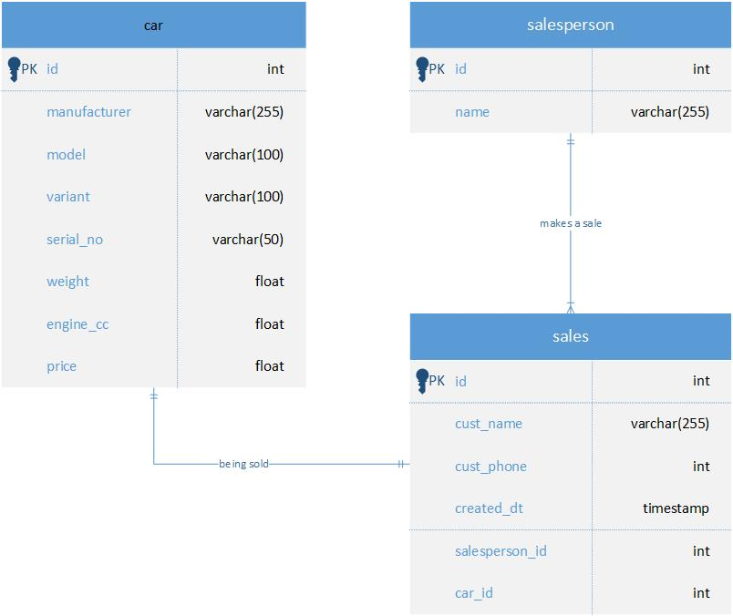

# Build Docker image
```
docker build -t dataeng_test .
```
# Create container from Docker image
```
docker run -d --name dataeng_test -e POSTGRES_PASSWORD=mysecretpassword -e PGDATA=/var/lib/postgressql/data/pgdata dataeng_test
```
# Entity-Relationship Diagram
